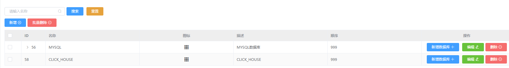
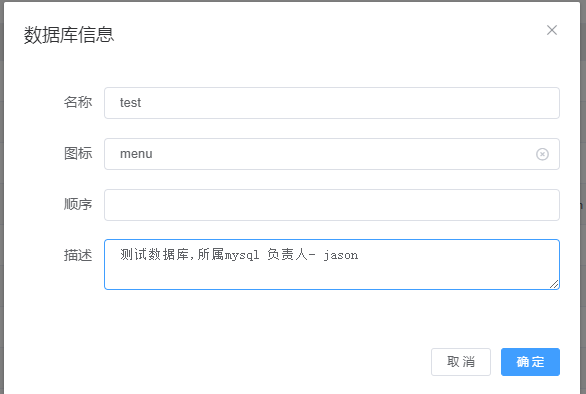
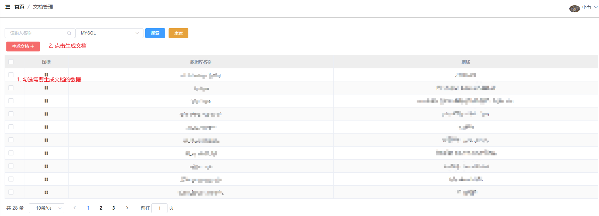
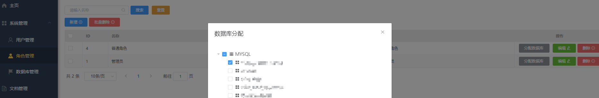
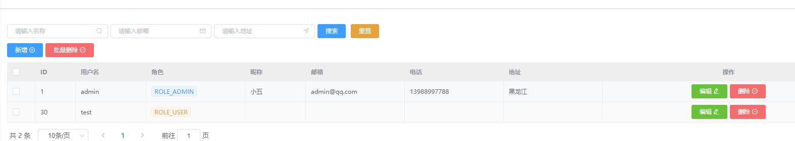
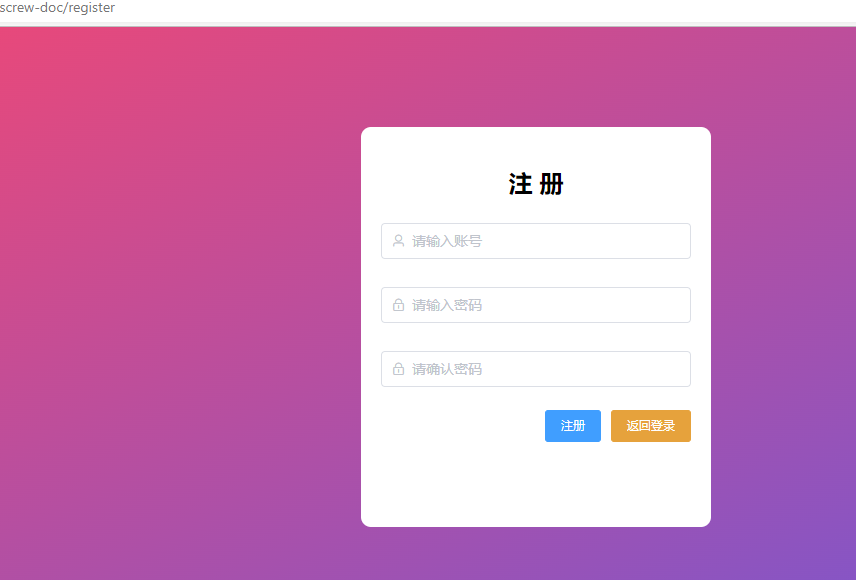
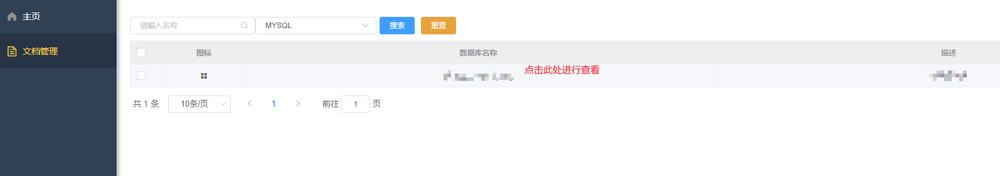
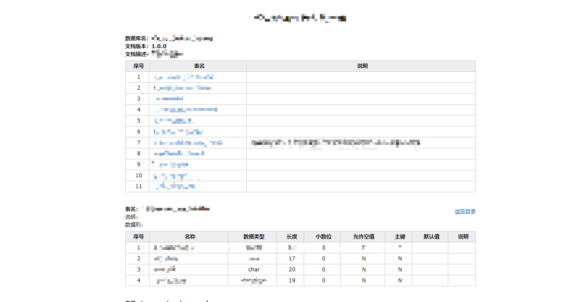

### 背景

> 在日常开发中, 伴随着许许多多的文档
>
> 业务文档, 需求文档, 开发文档 等等
>
> 随着业务范围逐渐扩大, 项目逐渐增多, 数据库逐渐开始变得难以管理
>
> 所以数据库文档也开始变得重要起来

### 目标

> 整合现有数据库(mysql/clickhouse), 做好文档规范
>
> 新人辅导向, 该项目可以达到更直观的数据库关系查看
>
> 方便开发人员的定期review

### 部署方式

- 需要一个数据库,并执行根目录下的init.sql
- Docker-compose部署, 可以直接使用docker-compose文件部署(先修改环境变量)

```
docker-compose up -d
```

- Docker部署

```
# docker run -d --name behappy-screw-doc --privileged=true --restart=no -p 8999:8080 -v /opt/dbdoc/doc:/user/src/app/doc wangxiaowu950330/behappy-screw-doc:latest
```

### 使用方式

> 两种角色

- 管理员角色
- 普通角色

#### **管理员角色**

针对于`管理员角色`允许`创建用户`,`生成数据库文档`以及`分配对应角色所需要的数据库`

如下

**创建数据库**





**生成文档**



**赋予对应角色所拥有的数据库**



**赋予test用户一个普通角色**



#### **普通角色**

**注册用户并登录**







### 访问地址

[访问地址](http://xxx:8999/screw-doc/index.html)

- [X]  mysql文档管理
- [X]  角色划分
- [X]  clickhouse文档管理
- [X]  redis缓存(适用在分布式环境部署)和caffeine进程缓存(适用在单机)两种方式
- [X]  容器化
- [X]  以/doc开头的访问地址解析token,并判断当前角色是否允许访问

### 注: 当前项目支持两种数据库, mysql和clickhouse, 但clickhouse因为screw原作者还未合代码, 所以如果是需要本地开发的话, 需要手动执行下此命令将jar包安装到本地库

```xml
参考: https://maven.apache.org/guides/mini/guide-3rd-party-jars-local.html

mvn org.apache.maven.plugins:maven-install-plugin:2.5.2:install-file -Dfile="lib/screw-core-1.0.6-SNAPSHOT.jar" -DpomFile="lib/screw-1.0.6-SNAPSHOT.pom"
cp lib/screw-core-1.0.6-SNAPSHOT.pom ~/.m2/repository/cn/smallbun/screw/screw/1.0.6-SNAPSHOT/screw-1.0.6-SNAPSHOT.pom
mvn org.apache.maven.plugins:maven-install-plugin:2.5.2:install-file -Dfile="lib/screw-core-1.0.6-SNAPSHOT.jar" -DpomFile="lib/screw-core-1.0.6-SNAPSHOT.pom"
```
