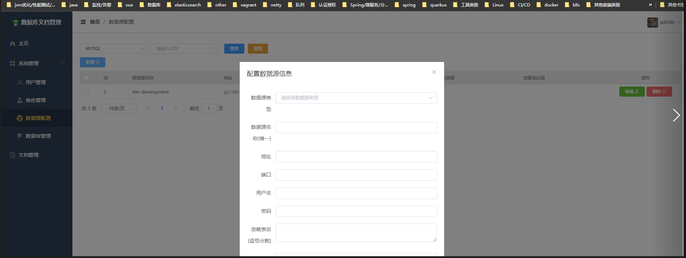
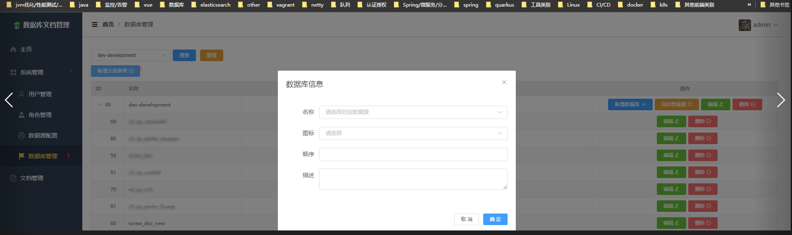
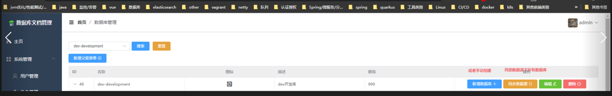
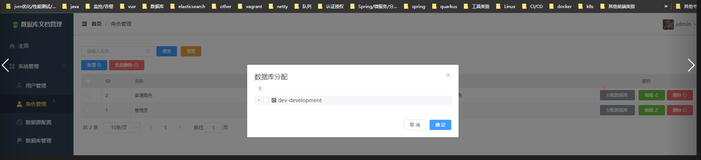
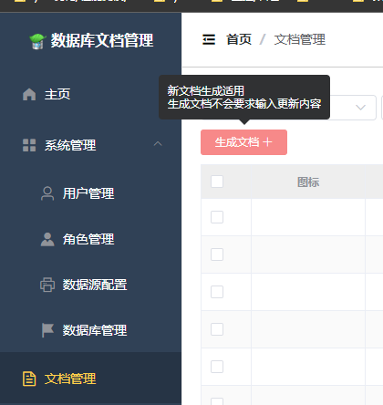
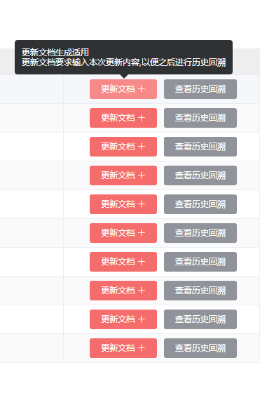
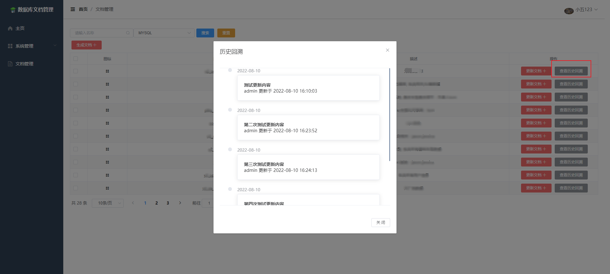

> 欢迎“一键三连[watch,fork,star]”

## 技术沟通群


### 背景

> 在日常开发中, 伴随着许许多多的文档
>
> 业务文档, 需求文档, 开发文档 等等
>
> 随着业务范围逐渐扩大, 项目逐渐增多, 数据库逐渐开始变得难以管理
>
> 所以数据库文档也开始变得重要起来

### 目标

> 整合现有数据库(支持mysql/clickhouse), 做好文档规范
>
> 新人辅导向, 该平台可以更直观的查看数据库关系
>
> 方便开发人员的定期review

### 部署方式(目前仅支持容器化部署)

- Docker-compose部署

```
# 下载./docker-compose文件，修改environment部分。具体含义见注释，然后执行以下命令
docker-compose up -d
```

- Docker部署

```
# 执行以下命令（记得指定环境变量）
docker run -d --name behappy-screw-doc --privileged=true --restart=no -p 8999:8080 -v /opt/dbdoc/doc:/user/src/app/doc wangxiaowu950330/behappy-screw-doc:latest
```

### 使用方式

```text
大体支持两种角色,一种ROLE_ADMIN.另一种是ROLE_XXX
ADMIN用于管理数据库,用户和角色信息
XXX为普通角色,用于查看所分配数据库信息
```

#### 先配置数据源信息



#### 配置数据库信息



#### 创建数据库/同步数据库



#### 对应角色分配数据库



#### admin账户执行初始化文档



### 历史回溯功能

此功能用于查询当前数据库的更新迭代信息





### 访问

```
http://xxx:8999/
账户: admin
密码: admin
```

- [X]  mysql文档管理
- [X]  clickhouse文档管理
- [X]  角色划分
- [X]  容器化支持
- [X]  数据更改后,可进行历史回溯
- [X]  手动初始化数据库数据改为自动初始化
- [X]  支持ldap登录
